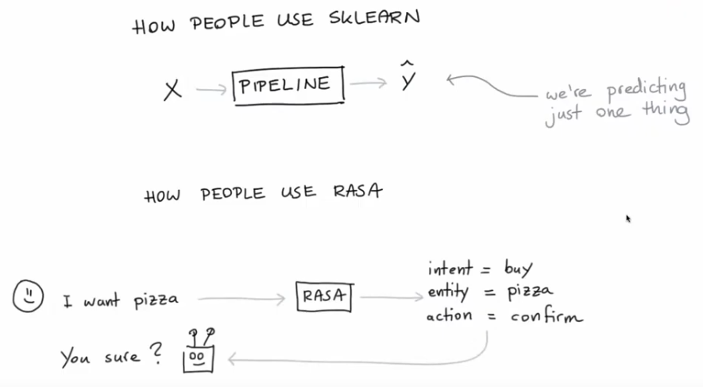

# Build the chat bot

When constructing a chat bot we need to be conscious of 'Artificial Stupidity', a term coined by Vincent Warmerdam,
Research Advocate for Rasa. The term refers to the dichotomy that systems that utilise artificial intelligence sometimes
"go dumb" and act stupid. In our case, _going dumb_ would refer to not replying user queries specifically.


Define each of the above for each sentence from the user:
- intent (classifier):
- entity (classifier):
- action (classifier):

Rasa provides building blocks to build customised chatbots with their own specific intent and custom features. No more
pipelines such as in Scikit-Learn, but with intent, entity and classifiers instead.

## Build process
### Rasa install
Installed the framework using `pip install rasa` on Python 3.8. The code dependencies can be seen in the `requirements.txt` file.

### Rasa Infrastructure
The file system is automatically generated by the framework once the user runs `rasa init`. The command will generate a 
series of folders and files to allow building the application.

## Conversation representation
If using a data pipeline system (with `csv` files), we would have to start the chatbot build process by importing such
csv file containing all the conversations. With Rasa, the conversations are stored in locations files.

Here, the folder `data` files such as:
```bash
.
├── nlu.yml     # natural language understanding data with examples of each intent/entities
├── rules.yml   # 
└── stories.yml # file containing the conversation intents followed by the system's actions
```

Moreover, the configuration files for the chatbot will be held at YAML files. Such as:
```bash
config.yml    # holds all the config for the machine learning tools and preprocessing
domain.yml    # contains an overview of intents, responses and allows for custom actions 
```

The command `rasa train` will _grab_ `stories.yml` and `stories.yml`, simulate conversations the user could have with the
bot and create a training set. The training data is then passed onto the Machine Learning pipeline in the  `config.yml`
file under `pipelines` field.

We have now a system which can take a story and map an intent to an action, actions will need to be defined (in the 
`domain.yml` file).

## How to develop the chatbot
1. add `intent` to `nlu.yml` with examples;
2. add `utter_XXX` to `responses` and to `intents` in the `domain.yml` file;
3. make sure the intent appears in a `story` otherwise no training data will be generated for the intent.